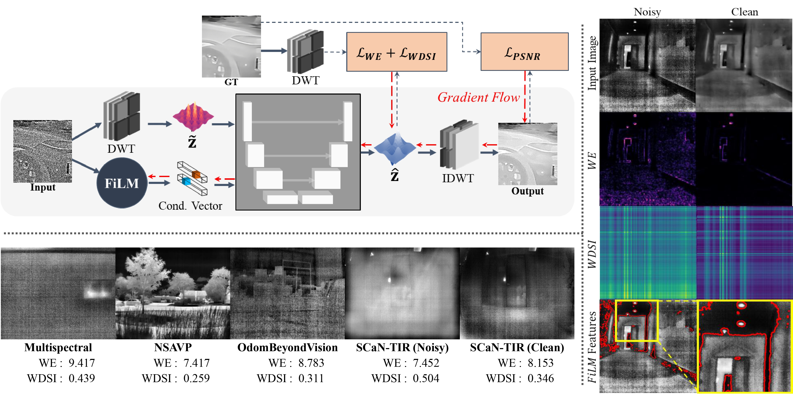
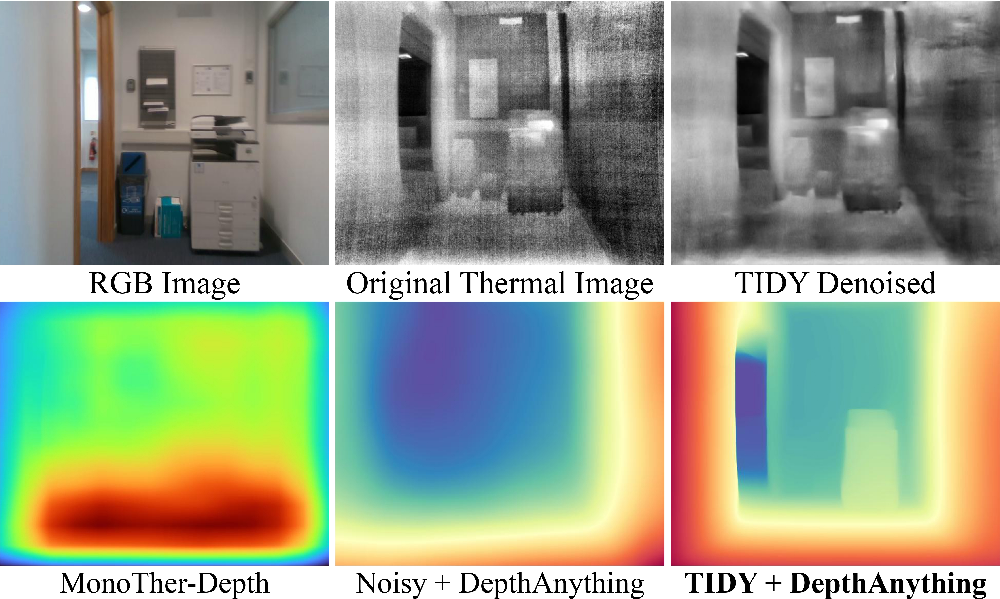

<div align="center">
  <p align="center">
  
</p>
  
<h1>
  <b>TIDY</b> :
  Thermal Infrared Image Denoising via <br>
  Wavelet Domain Entropy and Directional Stripe Index
</h1>


[**Tai Hyoung Rhee**](https://scholar.google.com/citations?user=PF8EfdYAAAAJ&hl=en&oi=ao)<sup>1</sup> · [**Dong-Guw Lee**](https://scholar.google.com/citations?user=u6VDnlgAAAAJ&hl=ko)<sup>1</sup> · [**Ayoung Kim**](https://ayoungk.github.io/)<sup>1&dagger;</sup>

<sup>1</sup>Seoul National University


**IROS 2026**

<a href='https://github.com/williamrheeth/TIDY/'></a>
<a href="https://rpm.snu.ac.kr"></a>
<a href="https://huggingface.co/datasets/williamrhee/SCaN-TIR"></a>
<!-- <a href="https://rpm.snu.ac.kr"></a> -->
</div>


## News
- ⚡ (2026-06-02): TIDY repo opening
- 🎉 (2026-06-17): Paper accepted to IROS 2026
- 📦 (2026-06-19): SCaN-TIR dataset released


  
<hr />

> **Abstract:** *Thermal infrared (TIR) imaging has been a popular choice for field robotics due to its robust perception capability under low light visual degradation, but it suffers from severe stochastic and fixed-pattern noise that breaks downstream estimation. This noise is intensified indoors due to low thermal contrast and uniform temperature distributions, contributing to the relative lack of indoor TIR deployments. Existing TIR denoising methods exhibit a poor accuracy-efficiency tradeoff, either too slow for online deployment required in robotics or insufficiently robust to severe degradation, while typically being trained on synthetic noise. Addressing these problems, we propose TIDY, a lightweight wavelet-domain denoiser trained on real clean-noisy TIR data. By reformulating TIR denoising in the wavelet domain, TIDY explicitly disentangles noise from structural content, enabling targeted suppression with reduced spatial complexity, significantly improving inference speed over prior methods (~34Hz). TIDY introduces two new metrics, Wavelet Entropy and Wavelet Directional Stripe Index, as complementary loss terms to explicitly suppress stochastic noise and stripe artifacts. Across severe indoor corruption and zero-shot settings, TIDY improves robustness and yields consistent gains in downstream robotics tasks including thermal inertial odometry and monocular depth estimation.* 
<hr />

## TIDY & SCaN-TIR Overview


### Network Architecture



### SCaN-TIR Dataset Overview Table

<details>
  <summary>Click to Expand</summary>

<table style="border-collapse: collapse; width: 80%;">
  <tr>
    <th style="border-bottom: 2px solid black;">Sequence</th>
    <th style="border-bottom: 2px solid black;"># Image Pairs</th>
    <th style="border-bottom: 2px solid black;">Duration</th>
    <th style="border-bottom: 2px solid black;">Scene</th>
  </tr>

  <tr><td><code>300_floor5</code></td><td>494</td><td>19.8s</td><td>Indoor</td></tr>
  <tr><td><code>300_to_303</code></td><td>4,698</td><td>187s</td><td>Outdoor</td></tr>
  <tr><td><code>301_118</code></td><td>4,329</td><td>173s</td><td>Indoor</td></tr>
  <tr><td><code>301_floor1</code></td><td>4,548</td><td>183s</td><td>Indoor</td></tr>
  <tr><td><code>301_floor12</code></td><td>5,973</td><td>241s</td><td>Indoor</td></tr>
  <tr><td><code>303_floor2</code></td><td>3,287</td><td>131s</td><td>Indoor</td></tr>
  <tr><td><code>303_floor5</code></td><td>3,045</td><td>121s</td><td>Indoor</td></tr>
  <tr><td><code>303_floor7</code></td><td>3,799</td><td>151s</td><td>Indoor</td></tr>
  <tr><td><code>303_bridge</code></td><td>2,217</td><td>88s</td><td>Outdoor</td></tr>
  <tr><td><code>test_300</code></td><td>132</td><td>5.3s</td><td>Indoor</td></tr>
  <tr><td><code>test_303</code></td><td>55</td><td>2.2s</td><td>Indoor</td></tr>

  <tr>
    <td><b>Total</b></td>
    <td><b>32,577</b></td>
    <td></td>
    <td></td>
  </tr>
</table>
</details>


### Zero-shot Results

<details>
  <summary>Click to Expand</summary>

</details>

### Downstream Enhancement

- Thermal-Inertial Odometry based on VINS-Mono
> <details>
>   <summary>Click to Expand</summary>
> 
>   
> 
> </details>


- Monocular Depth Estimation based on Depth Anything V3
> <details>
>   <summary>Click to Expand</summary>
> 
> </details>

---

## Downloading SCaN-TIR

The SCaN-TIR dataset is hosted on Hugging Face:

**Dataset:** https://huggingface.co/datasets/williamrhee/SCaN-TIR

Install the Hugging Face CLI:

```bash
pip install -U "huggingface_hub[cli]"
```

Download the dataset:

```bash
huggingface-cli download williamrhee/SCaN-TIR \
    --repo-type dataset \
    --local-dir SCaN-TIR
```

---

## Dataset Structure

```
  SCaN-TIR
  ├── {$SEQUENCE_NAME}
  |   ├── Clean
  |   |   ├── 0.png
  |   |   └── ...
  |   └── Noisy
  |       ├── 0.png
  |       └── ...
  ├── ...
  ├── ViVID
  |   ├── img_campus_day1
  |   |   ├── RGB
  |   |   |   ├── 000001.png
  |   |   |   └── ...
  |   |   └── TIR
  |   |       ├── 000001.png
  |   |       └── ...
  |   ├── ...
  ├── ...
  ```

---

## Citation
If you found our work useful, please cite
```
@inproceedings{rhee2026tidy,
  title={TIDY: Thermal Infrared Image Denoising via Wavelet Domain Entropy and Directional Stripe Index},
  author={Rhee, Tai Hyoung and Lee, Dong-guw and Kim, Ayoung},
  booktitle={IEEE/RSJ International Conference on Intelligent Robots and Systems (IROS)},
  year={2026},
  organization={IEEE}
}

```
