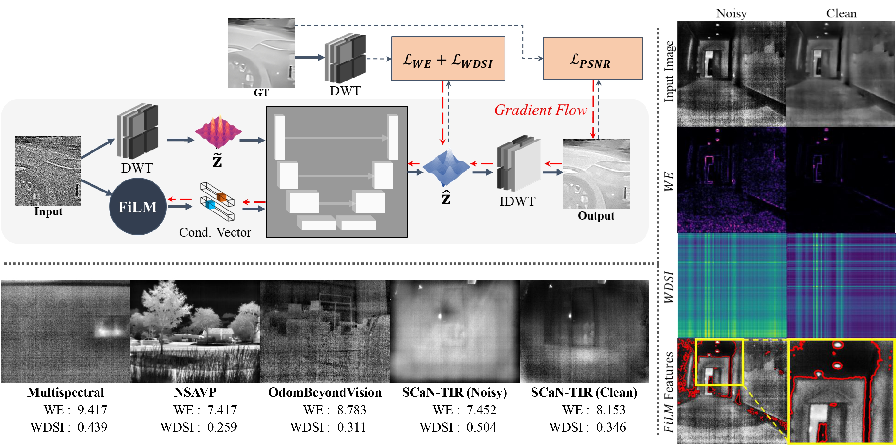
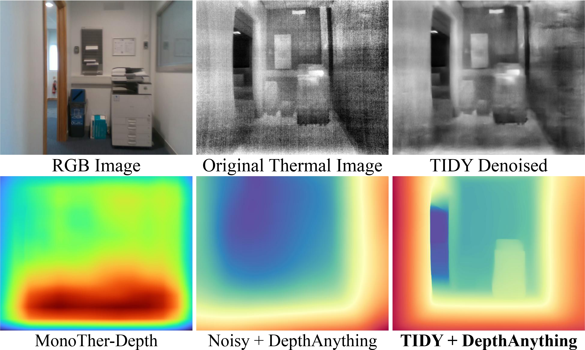

<div align="center">
  <p></p>

  <h1>
    <b>TIDY</b> : Thermal Infrared Image Denoising via<br>
    Wavelet Domain Entropy and Directional Stripe Index
  </h1>

  <p>
    <a href="https://scholar.google.com/citations?user=PF8EfdYAAAAJ&hl=en&oi=ao"><strong>Tai Hyoung Rhee</strong></a><sup>1</sup>
    &nbsp;&middot;&nbsp;
    <a href="https://scholar.google.com/citations?user=u6VDnlgAAAAJ&hl=ko"><strong>Dong-Guw Lee</strong></a><sup>1</sup>
    &nbsp;&middot;&nbsp;
    <a href="https://ayoungk.github.io/"><strong>Ayoung Kim</strong></a><sup>1&dagger;</sup>
  </p>

  <p><sup>1</sup>Seoul National University &nbsp;&middot;&nbsp; <sup>&dagger;</sup>Corresponding author</p>
  <p><strong>IROS 2026</strong></p>

  <p>
    <a href="https://github.com/williamrheeth/TIDY/"></a>
    <a href="https://arxiv.org/abs/2606.19813"></a>
    <a href="https://huggingface.co/datasets/williamrhee/SCaN-TIR"></a>
    <a href="https://youtu.be/PxcEG1ayDKE"></a>
    <a href="LICENSE"></a>
  </p>

  <p>A lightweight wavelet-domain network for fast and robust thermal infrared image denoising.</p>
</div>

## News

- ⚡ (2026-06-02): The TIDY repository was released.
- 🎉 (2026-06-17): TIDY was accepted to IROS 2026.
- 📦 (2026-06-19): The SCaN-TIR dataset was released.
- 💻 (2026-07-20): TIDY code released.

<hr />

> **Abstract:** *Thermal infrared (TIR) imaging has been a popular choice for field robotics due to its robust perception capability under low-light visual degradation, but it suffers from severe stochastic and fixed-pattern noise that breaks downstream estimation. This noise is intensified indoors due to low thermal contrast and uniform temperature distributions, contributing to the relative lack of indoor TIR deployments. Existing TIR denoising methods exhibit a poor accuracy-efficiency tradeoff: they are either too slow for online robotic deployment or insufficiently robust to severe degradation, and are typically trained on synthetic noise. To address these problems, we propose TIDY, a lightweight wavelet-domain denoiser trained on real clean-noisy TIR data. By reformulating TIR denoising in the wavelet domain, TIDY explicitly disentangles noise from structural content, enabling targeted suppression with reduced spatial complexity and an inference rate of approximately 34 Hz. TIDY introduces two metrics, Wavelet Entropy and Wavelet Directional Stripe Index, as complementary loss terms that explicitly suppress stochastic noise and stripe artifacts. Across severe indoor corruption and zero-shot settings, TIDY improves robustness and yields consistent gains in downstream robotic tasks, including thermal-inertial odometry and monocular depth estimation.*

<hr />

## TIDY & SCaN-TIR Overview

TIDY targets stochastic noise and fixed-pattern stripe artifacts in thermal infrared (TIR) imagery. It performs denoising in the wavelet domain, where structural content and noise can be handled more explicitly, and is trained on real clean-noisy image pairs from the **SCaN-TIR** dataset.

This repository provides a self-contained, inference-only implementation with:

- a minimal PyTorch runtime with no BasicSR, OpenCV, SciPy, or custom CUDA extensions;
- single-image, folder, and recursive folder inference;
- CPU, CUDA, and optional FP16 execution;
- optional ONNX Runtime and TensorRT backends; and
- automatic padding, so the original image resolution is preserved.

The only direct runtime packages are PyTorch, NumPy, and Pillow. The runtime also requires no `pytorch_wavelets`, LMDB, or training utilities.

### Network Architecture



### SCaN-TIR Dataset Overview Table

<details>
<summary>Click to Expand</summary>

| Sequence | Image pairs | Duration | Scene |
| --- | ---: | ---: | --- |
| `300_floor5` | 494 | 19.8 s | Indoor |
| `300_to_303` | 4,698 | 187 s | Outdoor |
| `301_118` | 4,329 | 173 s | Indoor |
| `301_floor1` | 4,548 | 183 s | Indoor |
| `301_floor12` | 5,973 | 241 s | Indoor |
| `303_floor2` | 3,287 | 131 s | Indoor |
| `303_floor5` | 3,045 | 121 s | Indoor |
| `303_floor7` | 3,799 | 151 s | Indoor |
| `303_bridge` | 2,217 | 88 s | Outdoor |
| `test_300` | 132 | 5.3 s | Indoor |
| `test_303` | 55 | 2.2 s | Indoor |
| **Total** | **32,577** |  |  |

</details>

### Zero-shot Results

<details>
<summary>Click to Expand</summary>


</details>

### Downstream Enhancement

<details>
<summary>Thermal-inertial odometry with VINS-Mono</summary>


</details>

<details>
<summary>Monocular depth estimation with Depth Anything V3</summary>



</details>

---

## Quick Start

### 1. Clone the repository

```bash
git clone https://github.com/williamrheeth/TIDY.git
cd TIDY
```

### 2. Create the environment

The recommended environment uses Python 3.11 and pins PyTorch 2.9.1 with CUDA 12.8. It is configured for NVIDIA RTX 50-series GPUs, including the RTX 5080:

```bash
conda env create -f environment.yml
conda activate tidy
```

The environment installs TIDY in editable mode, which makes the `tidy` command available from any directory. A separate CUDA Toolkit installation is not required, although CUDA inference requires a compatible NVIDIA driver.

No `PYTHONPATH` configuration is needed.

CUDA 12.8 GA requires NVIDIA driver 570.26 or newer on Linux; using a current production driver is recommended. PyTorch introduced Blackwell and CUDA 12.8 wheel support in version 2.7. See the [PyTorch 2.7 release](https://pytorch.org/blog/pytorch-2-7/) and [NVIDIA CUDA 12.8 release notes](https://docs.nvidia.com/cuda/archive/12.8.0/cuda-toolkit-release-notes/index.html).

Verify the installation:

```bash
tidy --version
```

<details>
<summary><strong>Alternative: install with pip</strong></summary>

```bash
conda create -n tidy python=3.11 -y
conda activate tidy
python -m pip install -r requirements.txt
```

</details>

### 3. Prepare the checkpoint

The default checkpoint location is:

```text
weights/tidy.pth
```

Download `tidy.pth` from the **Assets** section of the latest [GitHub Release](https://github.com/williamrheeth/TIDY/releases), then place it in `weights/`. The checkpoint is approximately 443 MiB and is distributed separately from the source code.

Once the release and checkpoint asset are published, you can also download it from the repository root with:

```bash
mkdir -p weights
curl -fL https://github.com/williamrheeth/TIDY/releases/latest/download/tidy.pth \
  -o weights/tidy.pth
```

You can also keep the checkpoint elsewhere and pass `--checkpoint /path/to/tidy.pth` when running inference.

Verify the checkpoint against the included checksum:

```bash
(cd weights && sha256sum -c SHA256SUMS)
```

### 4. Run inference

Denoise the included sample images:

```bash
tidy --input datasets/sample --output results/sample
```

The command automatically uses CUDA when available and otherwise falls back to CPU. Denoised images are written to `results/sample` with their original filenames.

## Inference Usage

### Single image

Write to a specific file:

```bash
tidy --input input.png --output denoised.png
```

Or write the result into a directory:

```bash
tidy --input input.png --output results/
```

### Image directory

Process every supported image directly inside a directory:

```bash
tidy --input path/to/noisy_images --output path/to/denoised_images
```

Add `--recursive` to include nested directories. Their relative layout is preserved in the output directory:

```bash
tidy \
  --input path/to/noisy_sequences \
  --output path/to/denoised_sequences \
  --recursive \
  --skip-existing
```

### Device and precision

```bash
# CPU
tidy -i input.png -o output.png --device cpu

# First visible CUDA device
tidy -i input.png -o output.png --device cuda

# A specific CUDA device with half-precision inference
tidy -i input.png -o output.png --device cuda:1 --fp16
```

To select a physical GPU with `CUDA_VISIBLE_DEVICES`:

```bash
CUDA_VISIBLE_DEVICES=1 tidy -i datasets/sample -o results/sample --fp16
```

The selected physical GPU appears as `cuda:0` inside TIDY when a single GPU is exposed through `CUDA_VISIBLE_DEVICES`.

### Command-line options

| Option | Description |
| --- | --- |
| `-i`, `--input PATH` | Input image or directory. Required. |
| `-o`, `--output PATH` | Output image or directory. Required. |
| `-c`, `--checkpoint PATH` | Checkpoint path. Defaults to `weights/tidy.pth`. |
| `--device DEVICE` | `auto`, `cpu`, `cuda`, or `cuda:N`. Defaults to `auto`. |
| `--fp16` | Use FP16 on CUDA to reduce memory use and improve throughput. |
| `--backend BACKEND` | `pytorch`, `onnx`, `tensorrt`, `onnx-tensorrt`, or `both`. |
| `--recursive` | Search subdirectories and preserve their relative layout. |
| `--skip-existing` | Leave existing output images unchanged. |
| `--onnx-model PATH` | ONNX artifact path. Defaults to `artifacts/tidy.onnx`. |
| `--tensorrt-engine PATH` | Native TensorRT engine path. Defaults to `artifacts/tidy_fp16.engine` or `artifacts/tidy_fp32.engine`, according to precision. |
| `--rebuild-artifacts` | Re-export ONNX or rebuild TensorRT artifacts. |

Run `tidy --help` for the complete interface. The repository-local launcher is equivalent:

```bash
python inference.py --input datasets/sample --output results/sample
```

### Input and output behavior

- Supported formats: PNG, JPEG, BMP, and TIFF.
- Inputs are read as normalized three-channel images. Grayscale thermal frames are replicated across the RGB channels.
- The CLI is intended for display-ready 8-bit thermal images, such as the SCaN-TIR `right_noisy` frames.
- Outputs are clamped to `[0, 1]` and saved as 8-bit RGB images.
- Input height and width do not need to be a fixed size; the output resolution matches the input resolution.
- TIDY refuses to overwrite an input image in place.

## Optional Accelerated Backends

PyTorch is the default and requires only `environment.yml`. For ONNX Runtime or TensorRT, create the accelerated environment instead:

```bash
conda env create -f environment-accelerated.yml
conda activate tidy-accelerated
```

You need only one environment. The accelerated environment includes the regular PyTorch backend as well as ONNX, ONNX Runtime GPU, and TensorRT.

It pins ONNX 1.18.0, ONNX Runtime GPU 1.22.0, and TensorRT 10.9.0.34. To install these dependencies with pip in an existing Python environment:

```bash
python -m pip install -r requirements-accelerated.txt
```

| Backend | Command | Notes |
| --- | --- | --- |
| PyTorch | `--backend pytorch` | Default; supports CPU/CUDA and FP16 on CUDA. |
| ONNX Runtime | `--backend onnx` | FP32; supports CPU or CUDA. |
| Native TensorRT | `--backend tensorrt --fp16` | CUDA only; builds a reusable engine. |
| ONNX Runtime + TensorRT | `--backend onnx-tensorrt --fp16` | CUDA only; uses TensorRT with CUDA fallback. `both` is an alias. |

Examples:

```bash
tidy --backend onnx \
  --input datasets/sample \
  --output results/onnx

tidy --backend tensorrt --fp16 \
  --input datasets/sample \
  --output results/tensorrt

tidy --backend onnx-tensorrt --fp16 \
  --input datasets/sample \
  --output results/onnx-tensorrt
```

The ONNX model is exported automatically on first use. TensorRT backends also perform a one-time engine optimization that can take several minutes. Generated files are cached under `artifacts/`; use `--rebuild-artifacts` after changing the checkpoint, model code, GPU, or TensorRT version.

Native TensorRT caches its engine, while the ONNX Runtime TensorRT provider (`onnx-tensorrt` or `both`) maintains its own reusable provider cache. Generated artifacts are excluded from Git and rebuilt locally as needed.

Artifacts can also be prepared explicitly:

```bash
tidy-deploy onnx
tidy-deploy tensorrt
```

The default native TensorRT profile accepts image sizes from `32x32` through `1080x1920` and is optimized for `256x640`. To use a different range:

```bash
tidy-deploy tensorrt \
  --min-shape 32x32 \
  --opt-shape 256x640 \
  --max-shape 1080x1920
```

> TensorRT engines are specific to the GPU and TensorRT version on which they are built. Rebuild the engine after moving to a different system.

TensorRT FP16 keeps TIDY's channel-normalization operations in FP32 to prevent numerical overflow while accelerating the convolution-heavy network. The same safeguard is enabled for the ONNX Runtime TensorRT provider.

---

## Downloading SCaN-TIR

SCaN-TIR contains **32,577** real clean-noisy TIR image pairs across indoor and outdoor sequences. The dataset is hosted on [Hugging Face](https://huggingface.co/datasets/williamrhee/SCaN-TIR).
```bash
python -m pip install -U huggingface_hub
hf download williamrhee/SCaN-TIR \
  --repo-type dataset \
  --local-dir SCaN-TIR
```

Sequences are stored as compressed archives on the Hub. For example, extract the `test_300` sequence with:

```bash
tar -xzf SCaN-TIR/SCaN-TIR/test_300.tar.gz -C SCaN-TIR
```

---

## Dataset Structure

```text
SCaN-TIR/
├── <sequence_name>/
│   ├── left_clean/
│   │   ├── frame_00000.png
│   │   └── ...
│   ├── right_noisy/
│   │   ├── frame_00000.png
│   │   └── ...
│   ├── thermal_14bit_left_image_raw/
│   │   ├── frame_00000.png
│   │   └── ...
│   └── thermal_14bit_right_image_raw/
│       ├── frame_00000.png
│       └── ...
└── ...
```

For inference on a downloaded noisy sequence:

```bash
tidy \
  --input SCaN-TIR/test_300/right_noisy \
  --output results/test_300
```

---

## Repository Layout

```text
TIDY/
├── tidy/                         # Model, checkpoint loader, backends, and CLI
├── weights/
│   ├── tidy.pth                  # Checkpoint downloaded from GitHub Releases
│   └── SHA256SUMS                # Checkpoint checksum
├── datasets/sample/              # Sample thermal images
├── tests/                        # Lightweight tests
├── inference.py                  # Repository-local launcher
├── environment.yml               # Standard PyTorch environment
├── environment-accelerated.yml   # Optional ONNX/TensorRT environment
├── requirements.txt              # Standard pip installation
├── requirements-accelerated.txt  # Optional accelerated pip installation
├── THIRD_PARTY_NOTICES.md        # Retained attribution
└── pyproject.toml                # Package metadata and CLI entry points
```

The old BasicSR option file is no longer required. The released architecture is fixed in `TIDYNet`, and checkpoint loading validates every learned tensor so an incompatible model cannot silently run.

### Publishing the checkpoint

`weights/tidy.pth` is approximately 443 MiB, which exceeds [GitHub's standard 100 MiB per-file limit](https://docs.github.com/en/repositories/working-with-files/managing-large-files/about-large-files-on-github). It is excluded from Git by `.gitignore`; the checksum file remains versioned.

After pushing the source code, create a GitHub Release from the same commit and attach `weights/tidy.pth` and `weights/SHA256SUMS` as release assets. Keep the checkpoint asset named `tidy.pth` and mark the release as the latest release so the download command above resolves correctly.

---

## Citation

If you find TIDY or SCaN-TIR useful in your research, please cite:

```bibtex
@inproceedings{rhee2026tidy,
  title        = {{TIDY}: Thermal Infrared Image Denoising via Wavelet Domain Entropy and Directional Stripe Index},
  author       = {Rhee, Tai Hyoung and Lee, Dong-Guw and Kim, Ayoung},
  booktitle    = {IEEE/RSJ International Conference on Intelligent Robots and Systems (IROS)},
  year         = {2026},
  organization = {IEEE}
}
```

## Acknowledgements

TIDY's network design builds on ideas introduced by [NAFNet](https://github.com/megvii-research/NAFNet). The inference runtime is an independent implementation and does not import or install NAFNet or BasicSR.

See [THIRD_PARTY_NOTICES.md](THIRD_PARTY_NOTICES.md) for retained attribution.

## License

This project is released under the [Creative Commons Attribution-NonCommercial 4.0 International License](LICENSE).
